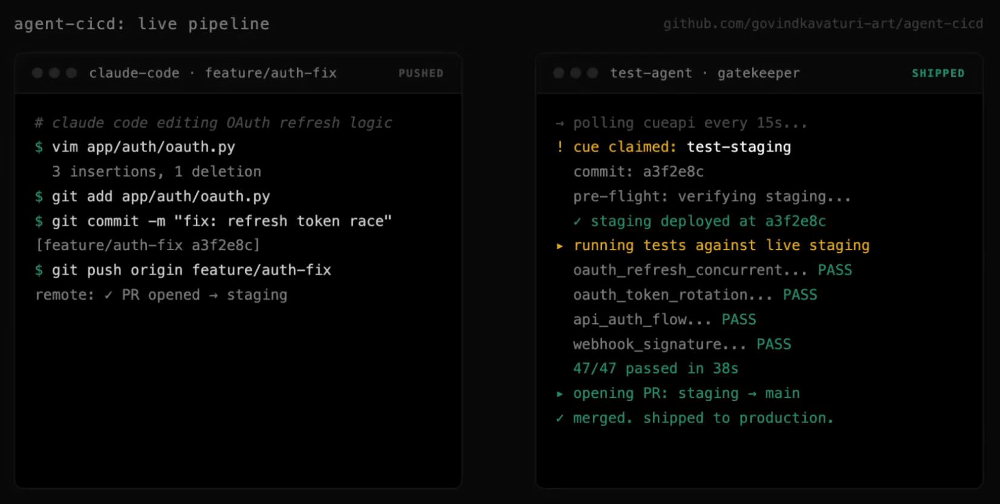
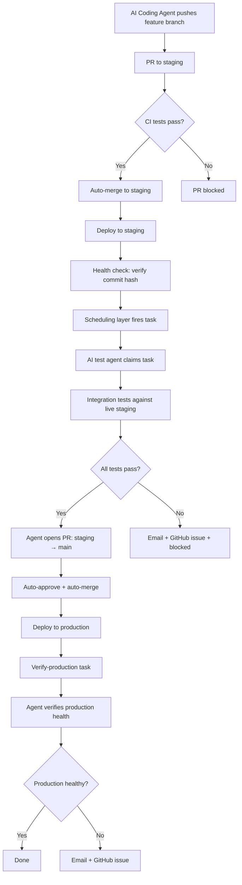
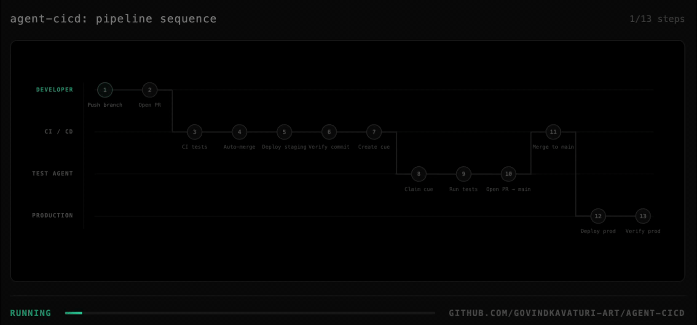

# agent-cicd

We let AI agents write code and push to our repos. They bypassed staging 28 times before we built this pipeline. Now they can't.



## What this is

A complete CI/CD pipeline template that ensures AI-generated code goes through proper testing before reaching production. Works with any language, any framework, any hosting platform.

## The pipeline



## What's included

```
.github/workflows/
  feature-to-staging.yml    # Tests on PR to staging, auto-merges
  staging-deploy.yml        # Deploys staging, creates test cue
  auto-approve-merge.yml    # Auto-approves bot PRs to main
  production-verify.yml     # Creates verify-production cue

agent/
  config.py                 # Your environment config
  test_staging.py           # Staging integration test runner
  verify_production.py      # Production health verifier
  failure_handler.py        # Email + GitHub issue on failure
  requirements.txt          # Python dependencies

scripts/
  setup_branch_protection.sh  # Configure branch rules via GitHub CLI
```

## How it works



Three ideas make this pipeline work:

**1. CI isn't enough.** CI runs in a fresh container against a test database. Real failures happen in deployed environments: config drift, infrastructure issues, stale caches, env var typos. This pipeline tests twice: standard CI on the PR (code-level bugs), then integration tests against live staging (deployment-level bugs). Both must pass before code reaches main.

**2. The handoff must be reliable.** When CI finishes deploying to staging, something has to tell the AI test agent "your turn." This pipeline uses a scheduling layer (CueAPI by default) so the agent can run on any machine, behind any firewall, and claim work within seconds.

**3. Commit hash verification prevents stale-deploy bugs.** Every deploy step checks the health endpoint and compares the commit hash to what was pushed. If they don't match, the pipeline halts before running tests against old code. This is the single most common failure mode in agent-driven CI.

> **Note:** This pipeline assumes your staging environment is isolated from production traffic. If your platform auto-deploys from the staging branch, staging is a real running environment, not a sandboxed preview. Make sure it's safe to break.

Code reaches production only after passing CI tests, deploying successfully, being verified live, and passing integration tests against the actual deployed environment. Failures at any stage block promotion and surface as GitHub issues + email.

## The AI test agent

The test agent is the gatekeeper between staging and main. It's a process running on any machine that does five things:

| # | Responsibility | What it does |
|---|---------------|--------------|
| 1 | **Claims work** | Polls the scheduling layer, claims tasks when they fire, heartbeats so the system knows it's alive |
| 2 | **Verifies code** | Checks the deployment's health endpoint and confirms the commit hash matches what was pushed. Aborts if stale |
| 3 | **Runs tests** | Executes your integration tests against the actual deployed staging URL. Real environment, not a mock |
| 4 | **Reports outcomes** | Tells the scheduling layer pass/fail. Notifies humans via email + GitHub issue (with dedup) |
| 5 | **Acts on results** | Pass → opens PR to main. Fail → blocks pipeline, files issue, exits non-zero |

### Setup options

You need a process running continuously somewhere. Pick whichever option fits your existing setup:

| Option | How to run it | Best for |
|--------|---------------|----------|
| **Minimum** | `pip install cueapi-worker && cueapi-worker` on any VM, Pi, or laptop | Getting started fast |
| **Claude Code** | Run `claude --dangerously-skip-permissions` in the agent directory on a dedicated machine | Dynamic test adaptation and richer failure analysis |
| **OpenClaw** | Point an existing agent fleet at the CueAPI worker | Teams already running an agent fleet |
| **Custom Python daemon** | Write your own polling loop against the CueAPI API (~80-100 lines) | Full control over claim/retry/report behavior |

The base `agent/` directory gives you working `test_staging.py` and `verify_production.py` scripts you can extend.

### What the agent needs

| Requirement | Why |
|-------------|-----|
| Python 3.9+ | Runtime for the test scripts |
| Network access to staging + production URLs | To run tests and check health |
| GitHub token (bot account) | To open promotion PRs and file failure issues |
| CueAPI API key | To claim cues and report outcomes |
| Resend API key (optional) | For failure email notifications |
| Continuous uptime | Tasks fire on every staging deploy, agent must be available |

### Optional capabilities worth adding

The base agent in this repo handles the five core responsibilities. As your pipeline matures, you'll want to add:

- **Progress reporting during long test runs** (background thread writing to a status file every N minutes, so you can see what's happening without polling)
- **State persistence** (latest run, failure logs, run history table)
- **Multi-stage test suites** (core tests run first, batch suites run after, non-blocking suites run last)
- **GitHub issue dedup** (if there's already an open issue from today, comment on it instead of opening a new one)
- **Mid-run credential rotation** (for high-volume API testing that hits rate limits)
- **Separate credentials per scope** (staging key, production key, GitHub token, notification key, limits blast radius if any one leaks)

These aren't required to start, but every team running this pipeline at scale ends up adding them.

## Quick start

See [SETUP.md](SETUP.md) for the full step-by-step guide. Estimated setup time: 30 minutes.

## Secrets needed

| Secret | Purpose |
|--------|---------|
| `DEPLOY_TOKEN` | GitHub PAT with `repo` + `workflow` scopes |
| `BOT_GITHUB_TOKEN` | Bot account PAT with `repo` scope |
| `CUEAPI_API_KEY` | CueAPI API key for scheduling test cues |
| `HEALTH_ENDPOINT_URL` | Your staging health endpoint URL |
| `RESEND_API_KEY` | (optional) Resend API key for failure emails |

## CueAPI

The handoff has been a big problem for me, so I ended up building a layer that holds the agent accountable. This pipeline assumes CueAPI as the default. You can use it hosted at [cueapi.ai](https://cueapi.ai) on the free tier, or self-hosted from [cueapi/cueapi-core](https://github.com/cueapi/cueapi-core).

You can use other approaches (webhook, polling, message queue). They're less reliable and need more work, but they're possible. To swap CueAPI out, change the cue creation steps in `staging-deploy.yml` and `production-verify.yml`, and the listening logic in `agent/test_staging.py` and `agent/verify_production.py`. The rest is plain GitHub Actions and Python.

## License

MIT
