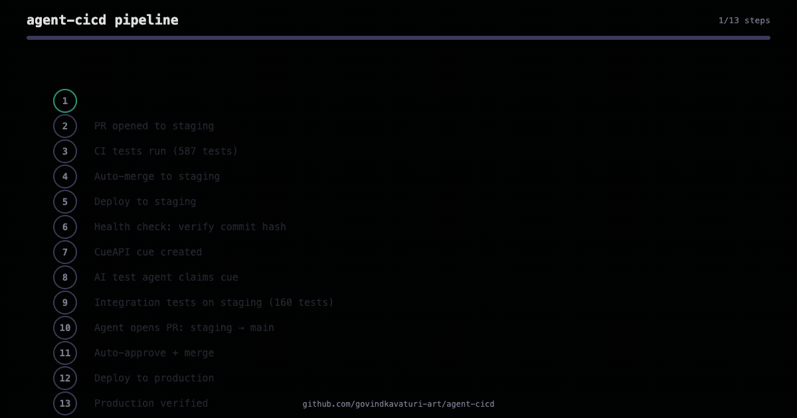
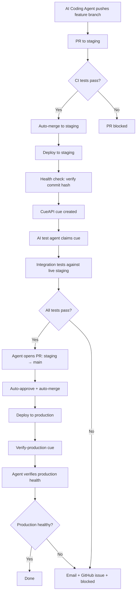

# agent-cicd

We let AI agents write code and push to our repos. They bypassed staging 28 times before we built this pipeline. Now they can't.

## What this is

A complete CI/CD pipeline template that ensures AI-generated code goes through proper testing before reaching production. Works with any language, any framework, any hosting platform.

## The pipeline





## What's included

```
.github/workflows/
  feature-to-staging.yml    # Tests on PR to staging, auto-merges
  staging-deploy.yml        # Deploys staging, creates test cue
  auto-approve-merge.yml    # Auto-approves bot PRs to main
  production-verify.yml     # Creates verify-production cue

agent/
  config.py                 # Your environment config
  test_staging.py           # Staging integration test runner
  verify_production.py      # Production health verifier
  failure_handler.py        # Email + GitHub issue on failure
  requirements.txt          # Python dependencies

scripts/
  setup_branch_protection.sh  # Configure branch rules via GitHub CLI
```

## Quick start

1. Copy the workflow files to your repo's `.github/workflows/`
2. Copy the `agent/` directory to your repo
3. Update `agent/config.py` with your URLs and repo info
4. Set up GitHub secrets (see `.env.example`)
5. Run `scripts/setup_branch_protection.sh your-org/your-repo`
6. Create a `staging` branch: `git checkout -b staging && git push origin staging`
7. Replace the TODO placeholders in workflow files with your actual commands

## Secrets needed

| Secret | Purpose |
|--------|---------|
| `DEPLOY_TOKEN` | GitHub PAT with `repo` + `workflow` scopes |
| `BOT_GITHUB_TOKEN` | Bot account PAT with `repo` scope |
| `CUEAPI_API_KEY` | CueAPI API key for scheduling test cues |
| `HEALTH_ENDPOINT_URL` | Your staging health endpoint URL |
| `RESEND_API_KEY` | (Optional) Resend API key for failure emails |

## CueAPI

This pipeline uses [CueAPI](https://cueapi.ai) for handoff between your CI workflows and your AI test agent. CueAPI is the scheduling and execution accountability layer that ensures your agent actually runs the tests and reports results.

*Full disclosure: I built CueAPI. This pipeline is how we use it internally.*

Two options:

- **Hosted:** Sign up at [cueapi.ai](https://cueapi.ai). Free tier gives you everything this pipeline needs.
- **Self-hosted:** CueAPI is open source. Clone and run your own instance from [cueapi/cueapi-core](https://github.com/cueapi/cueapi-core). You'll need Postgres and Redis.

## License

MIT
